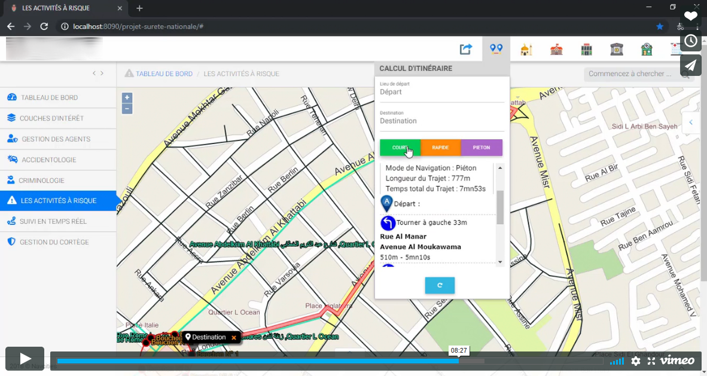

## National Security Project

National security is protecting a nation's critical infrastructure, its population's health and welfare, and sustainability of its economy.

This project consists of developing a **Geoenriched Web GIS Platform** to enhance national security. It presents features resulting in correct, quicker and better decisions and operations by mitigating threats and raising preparedness.

## Features

- Points of interest layers Module
- Agents Management Module
- Accidentology Module
- Criminology Module
- Risky Activities Module
- Real-time Tracking of Protests Module
- Management of Processions Module
- Data Analysis Dashboard Module

## Demo Video

The area of interest in the demo is the 4th district of Rabat, Morocco.

[](https://player.vimeo.com/video/460231506?autoplay=true)


## Built With

- [OpenLayers v4.6.5](https://openlayers.org/en/v4.6.5/apidoc/).
- [Ol-ext](https://viglino.github.io/ol-ext/).
- [API Navcities](http://www.navcities.com/site/documentation/index.html)
- [PostgreSQL 10.5](https://www.postgresql.org/docs/10/release-10-5.html)
- [PostGIS](https://postgis.net/)
- [Highcharts JS v6.1.1](https://www.highcharts.com/blog/download/).
- [Turf.js](http://turfjs.org/getting-started).
- [DataTables v1.10.19](https://cdn.datatables.net/1.10.19/).
- [SheetJS](http://sheetjs.com/).
- [jQuery v2.1.1](https://code.jquery.com/jquery/).
- [jQuery UI - v1.10.2](https://jqueryui.com/download/all/).
- [MDB](https://mdbootstrap.com/docs/jquery/getting-started/download/).
- Etc.

## Getting Started

### Prerequisites
- PHP 7.
- PostgreSQL **10.5** or above.
- PgAdmin 4.
- Any PHP Server.
- Activate **mb_strtoupper** extension :

  - In Windows :
  
    Edit your php.ini.

  - In a Linux-based system :
  
    ```console
    $ sudo apt install php-mbstring // Installing the extension
    $ sudo service apache2 restart // Restarting the apache server
    ```

### Installation

1. Clone this repository to your local php server directory.
2. Open pgadmin, then create a PostgreSQL database.
3. Right click on your database, choose **Restore** and put this [database backup](spatial-database/script.backup) in **Filename**, then click on **Restore** button.
4. Change the parameters of the **connection_string** in [assets/php/connect.php](assets/php/connect.php) based on your credentials, see the example below :

    ```
    host=localhost
    port=5432
    dbname=postgres
    user=postgres
    password=postgres
    ```
5. Open your browser, then access to the web application, by default : [localhost/national-security-project](http://localhost/national-security-project).

## Notes
- If you get any warnings while restoring the database but the tables were imported successfully, just ignore them and continue.

- To enable errors output in the browser's console, change this variable to **true** in [assets/js/GestionDesModules.js](assets/js/GestionDesModules.js).

    ```javascript
    var rappErreurs = true;
    ```

## License

[](https://github.com/sambakk/national-security-project/blob/master/LICENSE)    


